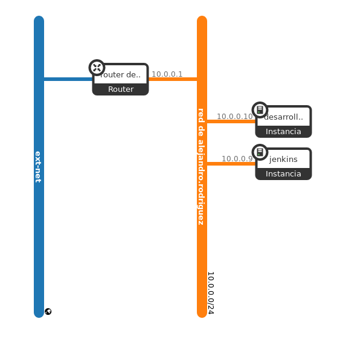

## Índice

1. [Introducción](https://github.com/alexrr12341/Jenkins-con-Docker/blob/master/Proyecto.md#1-introducción)
   - [Descripción del proyecto](https://github.com/alexrr12341/Jenkins-con-Docker/blob/master/Proyecto.md#11-descripci%C3%B3n-del-proyecto)
   - [Escenario](https://github.com/alexrr12341/Jenkins-con-Docker/blob/master/Proyecto.md#12-escenario)
2. [¿Qué es Jenkins?](https://github.com/alexrr12341/Jenkins-con-Docker/blob/master/Proyecto.md#2-qu%C3%A9-es-jenkins)
## 1. Introducción

### 1.1. Descripción del proyecto

El objetivo del proyecto es la creación de distintos Jenkinsfiles para controlar diversos test que realizaremos a la hora de la creación de imagenes en Docker.
Si esos test son pasados, se procederá a subir la imagen a Dockerhub y será llevado a producción.

Primero la máquina desarrollo será la que haga actualizaciones a nuestra aplicación en github, en ese repositorio tendremos un Jenkinsfile que ejecutará una serie de procesos para que se pueda subir la aplicación a la máquina de producción.

La máquina jenkins será la que tenga alojada jenkins y actuará como servidor principal y la que subirá la imagen a DockerHub y si pasa todos los test será desplegada.

### 1.2. Escenario

* Jenkins (172.22.201.144): Debian Buster 10.3, 2 Cpus, 4 GB RAM, 20 GB espacio
* Desarrollo (172.22.200.55): Debian Buster 10.3, 2 Cpus, 1 GB RAM, 10 GB espacio

## 2. ¿Qué es Jenkins?
**Jenkins** es un servidor de automatización open source escrito en **Java**. Está basado en el proyecto Hudson y es, dependiendo de la visión, **un fork del proyecto o simplemente un cambio de nombre.**

Jenkins ayuda en la automatización de parte del proceso de desarrollo de software mediante **integración continua** y facilita ciertos aspectos de la **entrega continua**. Admite herramientas de control de versiones como **CVS, Subversion, Git, Mercurial, Perforce y Clearcase** y puede ejecutar proyectos basados en **Apache Ant y Apache Maven**, así como secuencias de comandos de consola y programas por lotes de Windows. El desarrollador principal es **Kohsuke Kawaguchi**. Publicado bajo licencia **MIT**, Jenkins es **software libre**.​ 
