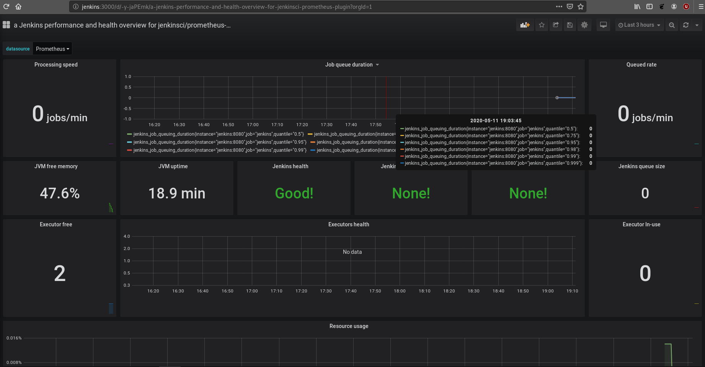

## Índice

1. [Introducción](https://github.com/alexrr12341/Jenkins-con-Docker/blob/master/Proyecto.md#1-introducción)
   - [Descripción del proyecto](https://github.com/alexrr12341/Jenkins-con-Docker/blob/master/Proyecto.md#11-descripci%C3%B3n-del-proyecto)
   - [Escenario](https://github.com/alexrr12341/Jenkins-con-Docker/blob/master/Proyecto.md#12-escenario)
2. [¿Qué es Jenkins?](https://github.com/alexrr12341/Jenkins-con-Docker/blob/master/Proyecto.md#2-qu%C3%A9-es-jenkins)
3. [¿Qué es Docker?](https://github.com/alexrr12341/Jenkins-con-Docker/blob/master/Proyecto.md#3-qu%C3%A9-es-docker)
   - [Contenedores](https://github.com/alexrr12341/Jenkins-con-Docker/blob/master/Proyecto.md#31-contenedores)
   - [Docker](https://github.com/alexrr12341/Jenkins-con-Docker/blob/master/Proyecto.md#32-docker)
4. [Instalaciones](https://github.com/alexrr12341/Jenkins-con-Docker/blob/master/Proyecto.md#4-instalaciones)
   - [Docker](https://github.com/alexrr12341/Jenkins-con-Docker/blob/master/Proyecto.md#41-docker)
   - [Jenkins](https://github.com/alexrr12341/Jenkins-con-Docker/blob/master/Proyecto.md#42-jenkins)
      - [Via Docker](https://github.com/alexrr12341/Jenkins-con-Docker/blob/master/Proyecto.md#421-via-docker)
      - [Via Apt](https://github.com/alexrr12341/Jenkins-con-Docker/blob/master/Proyecto.md#422-via-apt)
   - [Prometheus](https://github.com/alexrr12341/Jenkins-con-Docker/blob/master/Proyecto.md#43-prometheus)
   - [Grafana](https://github.com/alexrr12341/Jenkins-con-Docker/blob/master/Proyecto.md#44-grafana)
5. [Plugins](https://github.com/alexrr12341/Jenkins-con-Docker/blob/master/Proyecto.md#5-plugins)
   - [Docker](https://github.com/alexrr12341/Jenkins-con-Docker/blob/master/Proyecto.md#51-docker)
   - [Blue Ocean](https://github.com/alexrr12341/Jenkins-con-Docker/blob/master/Proyecto.md#52-blue-ocean)
   - [Prometheus](https://github.com/alexrr12341/Jenkins-con-Docker/blob/master/Proyecto.md#53-prometheus)
6. [Métricas](https://github.com/alexrr12341/Jenkins-con-Docker/blob/master/Proyecto.md#6-métricas)
7. [Pipelines](https://github.com/alexrr12341/Jenkins-con-Docker/blob/master/Proyecto.md#7-pipelines)
   - [¿Qué es un Pipeline?](https://github.com/alexrr12341/Jenkins-con-Docker/blob/master/Proyecto.md#71-qu%C3%A9-es-un-pipeline)
   - [Pipeline Declarativo (Jenkinsfile)](https://github.com/alexrr12341/Jenkins-con-Docker/blob/master/Proyecto.md#72-pipeline-declarativo-jenkinsfile)
8. [Puesta en marcha](https://github.com/alexrr12341/Jenkins-con-Docker/blob/master/Proyecto.md#8-puesta-en-marcha)
   - [Creacion del entorno](https://github.com/alexrr12341/Jenkins-con-Docker/blob/master/Proyecto.md#81-creaci%C3%B3n-del-entorno)
10. [Webgrafía](https://github.com/alexrr12341/Jenkins-con-Docker/blob/master/Proyecto.md#10-webgraf%C3%ADa)
## 1. Introducción

### 1.1. Descripción del proyecto

El objetivo del proyecto es la creación de distintos Jenkinsfiles para controlar diversos test que realizaremos a la hora de la creación de imagenes en Docker.
Si esos test son pasados, se procederá a subir la imagen a Dockerhub y será llevado a producción.

Primero la máquina desarrollo será la que haga actualizaciones a nuestra aplicación en github, en ese repositorio tendremos un Jenkinsfile que ejecutará una serie de procesos para que se pueda subir la aplicación a la máquina de producción.

La máquina jenkins será la que tenga alojada jenkins y actuará como servidor principal y la que subirá la imagen a DockerHub y si pasa todos los test será desplegada.

### 1.2. Escenario


* Jenkins (172.22.201.144): Debian Buster 10.3, 2 Cpus, 4 GB RAM, 20 GB espacio
* Desarrollo (172.22.200.55): Debian Buster 10.3, 2 Cpus, 1 GB RAM, 10 GB espacio

## 2. ¿Qué es Jenkins?
**Jenkins** es un servidor de automatización open source escrito en **Java**. Está basado en el proyecto Hudson y es, dependiendo de la visión, **un fork del proyecto o simplemente un cambio de nombre.**

Jenkins ayuda en la automatización de parte del proceso de desarrollo de software mediante **integración continua** y facilita ciertos aspectos de la **entrega continua**. Admite herramientas de control de versiones como **CVS, Subversion, Git, Mercurial, Perforce y Clearcase** y puede ejecutar proyectos basados en **Apache Ant y Apache Maven**, así como secuencias de comandos de consola y programas por lotes de Windows. El desarrollador principal es **Kohsuke Kawaguchi**. Publicado bajo licencia **MIT**, Jenkins es **software libre**.​ 

## 3. ¿Qué es Docker?

### 3.1. Contenedores
Los contenedores le ofrecen un modo estándar de **empaquetar el código, las configuraciones y las dependencias de su aplicación en un único objeto**. Los contenedores **comparten un sistema operativo** instalado en el servidor, y se **ejecutan como procesos aislados de los recursos**, lo que garantiza **implementaciones rápidas, fiables y consistentes** sea cual sea el entorno en el que se realizan. 


### 3.2. Docker
Docker es un proyecto de **código abierto** que **automatiza el despliegue de aplicaciones** dentro de **contenedores de software**, proporcionando una capa adicional de abstracción y automatización de virtualización de aplicaciones en múltiples sistemas operativos. Docker utiliza características de aislamiento de recursos del kernel Linux, tales como **cgroups** y **espacios de nombres** (namespaces) para permitir que "contenedores" independientes se **ejecuten dentro de una sola instancia de Linux**, evitando la **sobrecarga** de iniciar y mantener máquinas virtuales.

## 4. Instalaciones

### 4.1. Docker
En Debian 10 (Buster) implementaron en la paquetería la instalación de Docker mediante apt, entonces simplemente para instalarlo deberiamos hacer:
```bash
apt install docker.io
```

Esta instalación lo haremos en ambas máquinas.


### 4.2. Jenkins

### 4.2.1. Via Docker

Para instalar Jenkins via Docker, debemos primero tener docker instalado como hemos hecho anteriormente, y luego cogemos la imágen de Jenkins de DockerHub, realizando el siguiente comando:
```
docker pull jenkins/jenkins
```

Vamos a crear una network para el futuro también
```
docker network create jenkins
```

Teniendo dicha imagen, vamos ahora a lanzar el contenedor con el siguiente comando:
```
docker run -d --name jenkins --network jenkins -p 8080:8080 -p 50000:50000 -v /opt/jenkins_home:/var/jenkins_home jenkins/jenkins
```

docker run -d --name jenkins --network jenkins -p 8080:8080 -p 50000:50000 -v /opt/jenkins_home:/var/jenkins_home -v /var/run/docker.sock:/var/run/docker.sock alexrr12341/myjenkins:v1

Nos saltará el siguiente error a la hora de hacer el volumen persistente, ya que no tiene los permisos del usuario de jenkins
```
Can not write to /var/jenkins_home/copy_reference_file.log. Wrong volume permissions?
touch: cannot touch '/var/jenkins_home/copy_reference_file.log': Permission denied
```

En la documentación de Jenkins nos sugieren cambiar los permisos de la carpeta por 1000, por lo que realizaremos el siguiente comando:

```
chown -R 1000 /opt/jenkins_home
```

Y volvemos a ejecutar el comando:

```
docker run -d --name jenkins --network jenkins -p 8080:8080 -p 50000:50000 -v /opt/jenkins_home:/var/jenkins_home jenkins/jenkins
```

Vemos que la imagen está funcionando:

```
root@jenkins:~# docker ps
CONTAINER ID        IMAGE               COMMAND                  CREATED             STATUS              PORTS                                              NAMES
4fe902387548        jenkins/jenkins     "/sbin/tini -- /usr/…"   6 seconds ago       Up 5 seconds        0.0.0.0:8080->8080/tcp, 0.0.0.0:50000->50000/tcp   jenkins

```

Y entramos al puerto 8080 de nuestra máquina para acceder al panel web: http://jenkins:8080/ y instalar los plugins necesarios. El código de verificación estará en este caso en /opt/jenkins_home/secrets

### 4.2.2. Via Apt

Para instalar Jenkins via Apt, debemos primero poner el repositorio de jenkins, para ello vamos a añadir una nueva entrada en nuestros repositorios, añadiremos la clave e instalaremos jenkins. Lo haremos con los siguientes comandos:

```
wget -q -O - https://pkg.jenkins.io/debian-stable/jenkins.io.key | sudo apt-key add -
sudo sh -c 'echo deb https://pkg.jenkins.io/debian-stable binary/ > /etc/apt/sources.list.d/jenkins.list'
sudo apt-get update
sudo apt-get install jenkins
```

Después de la instalación, iremos a /var/jenkins_home/secrets para cojer la contraseña para acceder al panel web, que se accederá de la misma manera que en docker: http://jenkins:8080/

### 4.3. Prometheus

Vamos a realizar la instalación de prometheus via docker, por lo que solo tendremos que ejecutar el siguiente comando para que lo tengamos:

```
docker run --name prometheus --network jenkins -p 9090:9090  -d --mount type=bind,source=/opt/prometheus.yml,target=/etc/prometheus/prometheus.yml prom/prometheus
```

### 4.4. Grafana

Vamos a realizar la instalación de grafanas por docker, por lo que tendremos que ejecutar el contenedor con la imagen de grafana:

```
docker run -d --name grafana --network jenkins -p 3000:3000 grafana/grafana
```

## 5. Plugins

### 5.1. Docker

Para la instalación de este plugin es muy sencilla, debemos ir a Manage Jenkins -> Manage Plugins -> Available, Buscamos docker en el buscador y le damos el tick al que pone Docker y la opción de 'Download now and install after restart'.
Este plugin lo que hará es que podramos integrar los comandos de docker en nuestros pipelines de Jenkins.

Para conseguir que funcione, en este caso pondremos en Configure Cloud: unix:///var/run/docker.soc


### 5.2. Blue Ocean

Para la instalación es como el anterior, debemos ir a Manage Jenkins -> Manage Plugins -> Available, buscar blueocean en el buscador y le damos tick al que pone Blue Ocean, y Blue Ocean Pipeline Editor y la opción de 'Download now and install after restart'.

Blue Ocean es un plugin de jenkins por el cual podremos ver todas las funcionalidades de un Pipeline y ver los resultados obtenidos de cada uno.

### 5.3. Prometheus

Para instalar este plugin, debemos ir a Manage Jenkins -> Manage Plugins -> Available y buscar el que pone: Prometheus metrics, y le damos tick y a la opción de 'Download now and install after restart'.

Esto lo que hará es que Jenkins se pueda comunicar con prometheus para analizar las métricas.


## 6. Métricas

Para la configuración de métricas, ya que tenemos prometheus y grafana disponibles, debemos conectar prometheus con el nodo de jenkins, para ello indicamos en el /opt/prometheus.yml el nuevo job para que pueda comunicarse

```
- job_name: 'jenkins'
  metrics_path: /prometheus
  static_configs:
    - targets: ['172.17.0.1:8080']
```

Para comprobar que va correctamente, simplemente entramos a http://jenkins:9090 y miramos que al lado del botón de Execute tenemos varios jenkins_*


Ahora debemos conectar grafana con prometheus, por lo que vamos hacia http://jenkins:3000.

Vamos a la opción donde pone 'Add data source' y seleccionamos la opción de Prometheus.

La url en este caso será: http://prometheus:9090


Para crear el dashboard de grafana, vamos hacia Home Dashboard -> New Dashboard y vamos creando los diferentes dashboards necesarios.

En mi caso utilizaré la siguiente plantilla: https://grafana.com/grafana/dashboards/9524, que se puede poner en Import.



## 7. Pipelines

### 7.1. ¿Qué es un Pipeline?

Un pipeline es una nueva forma de trabajar en el mundo devops en la integración continua. Utilizando pipeline y Jenkins, podemos definir el ciclo de vida completo de una aplicación (descargar código, compilar, test, desplegar, etc.) mediante código.

De esta forma, resulta mucho más sencillo replicar los diferentes pasos con distintas aplicaciones y gestionar mejor los cambios en cada paso.

### 7.2. Pipeline Declarativo (Jenkinsfile)

Un pipeline declarativo es aquel que podemos crear, editar o configurar mediante una estructura definida que nos ayuda a entender y predecir los pasos del pipeline. Simplifica y da opciones a la sintaxis de los sub-sistemas de pipeline.
Al igual que los descriptivos, los pipelines declarativos deben guardarse en un fichero Jenkinsfile para poder ser ejecutados luego por Jenkins.

Su sintaxis sería la siguiente:

   * **Pipeline {}** Identificamos dónde empieza y termina el pipeline así como los pasos que tiene.

   * **Agent.** Especificamos cuando se ejecuta el pipeline. Uno de los comandos más utilizados es any, para ejecutar el pipeline siempre y cuando haya un ejecutor libre en Jenkins.

   * **Stages.** Bloque donde se definen una serie de estados a realizar dentro del pipeline.

   * **Stage.** Bloque que define una serie de tareas realizadas dentro del pipeline, por ejemplo: Build. test, deploy, etc. Podemos utilizar varios plugins en Jenkins para visualizar el estado o el progreso de estos estados.
   * **Steps.** Son todos los pasos a realizar dentro de un stage. Podemos definir uno o varios pasos.

   * **Step.** Es una tarea simple dentro del pipeline. Fundamentalmente es un paso donde se le dice a Jenkins qué hacer en un momento específico o paso del proceso. Por ejemplo, para ejecutar un comando en shell podemos tener un paso en el que tengamos la línea 'sh ls' para mostrar el listado de ficheros de una carpeta.


## 8. Puesta en marcha

### 8.1. Creación del entorno git.

Para la realización del entorno, utilizaremos este mismo repositorio de GitHub. En este repositorio vamos a crear dos ramas:

* Desarrollo: Es la rama que contendrá el Jenkinsfile con los distintos tests
* Producción: Es la rama que contendrá los cambios actuales de la página web.

Para ello realizamos los siguientes comandos en nuestro repositorio de github que hemos clonado en nuestro ordenador.

```
alexrr@pc-alex:~/git/Jenkins-con-Docker$ git branch desarrollo
alexrr@pc-alex:~/git/Jenkins-con-Docker$ git branch produccion
alexrr@pc-alex:~/git/Jenkins-con-Docker$ git push -u origin desarrollo
alexrr@pc-alex:~/git/Jenkins-con-Docker$ git push -u origin produccion
```

Entonces vamos a clonar el branch de desarrollo en la máquina desarrollo.
```
root@desarrollo:~# git clone --branch desarrollo https://github.com/alexrr12341/Jenkins-con-Docker
```


### 8.2. Creación de Jenkinsfile y Dockerfile

Ahora podemos comenzar con el entorno de producción automatizado, dicho entorno tendrá un wordpress básico, y el de desarrollo tendrá un wordpress distinto, y podremos ver como se cambia automáticamente.


Tendremos un Dockerfile para la creación de la imágen wordpress que sería el siguiente:

```
FROM php:apache-buster
RUN docker-php-ext-install pdo pdo_mysql mysqli json
RUN a2enmod rewrite
EXPOSE 80
WORKDIR /var/www/html
COPY ./wordpress /var/www/html
ENTRYPOINT ["/usr/sbin/apache2ctl", "-D", "FOREGROUND"]
```

Ejecutaremos antes una base de datos para que funcione wordpress en el entorno de produccion:

```
docker run -d --name mariadb --network jenkins -v /opt/bbdd_mariadb:/var/lib/mysql -e MYSQL_DATABASE=wordpress -e MYSQL_USER=wordpress -e MYSQL_PASSWORD=wordpress -e MYSQL_ROOT_PASSWORD=asdasd mariadb
```

También tendremos el Jenkinsfile, que será el siguiente:

```
pipeline {
  agent any
  stages {
    stage('Build') {
      steps {
	sh 'git clone --branch desarrollo https://github.com/alexrr12341/Jenkins-con-Docker'
        sh 'docker build -t pagina:test .'
      }
    }
    stage('Test') {
      steps {
        echo 'Testing...'
        sh 'docker run --rm --name appjenkins -d -p 80:80 pagina:test'
        sh '/bin/nc -vz localhost 80'
	sh '''
            #!/bin/bash
            echo "hello world"
         '''
        sh 'docker stop appjenkins'
      }
    }
  }
}

```

### 8.2. Creación del Jenkinsfile

Ahora vamos a realizar la creación del Jenkinsfile que estará en la rama desarrollo, dicho jenkins analizará si dispone de suficientes recursos para lanzar la nueva imagen docker, si están funcionando correctamente los servidores de mysql y apache y si la página responde las peticiones.

## 10. Webgrafía

[Instalación de Jenkins](https://www.jenkins.io/doc/book/installing/)

[Monitorización de Jenkins](https://medium.com/@eng.mohamed.m.saeed/monitoring-jenkins-with-grafana-and-prometheus-a7e037cbb376)

[Plugin de Docker](https://plugins.jenkins.io/docker-plugin/)

[Pipelines](https://sdos.es/blog/la-integracion-continua-actual-pasa-por-pipelines)
