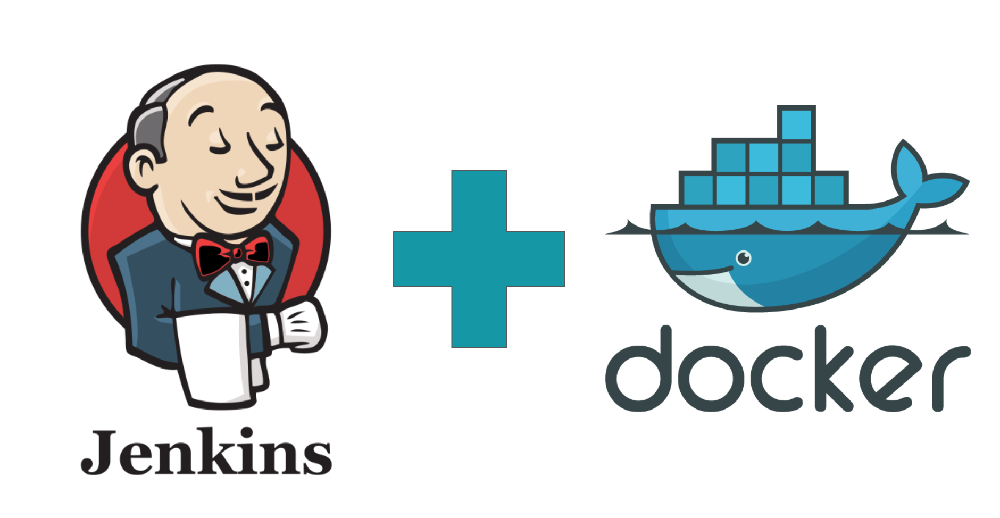

# Jenkins con Docker

**Detalles del proyecto de fin de curso**

Vamos a utilizar la tecnología de Jenkins para verificar ciertos parámetros a la hora de realizar una imagen de Docker, si pasan dichos test, se subirá la imagen a DockerHub y se lanzará algun despliegue.

**Tecnologías que se van a usar**

Vamos a utilizar una máquina Debian Buster que contendrá los siguientes programas:

* Docker.io
* Jenkins y sus plugins
* Prometheus
* Grafana

**Resultados esperados**

* Queremos aprender el uso de los plugins de Docker y de las métricas de Jenkins.
* Saber con soltura el uso de los Jenkinsfile y manejar los pipelines de Jenkins

El proyecto lo encontraremos [aqui](./Proyecto.md)
